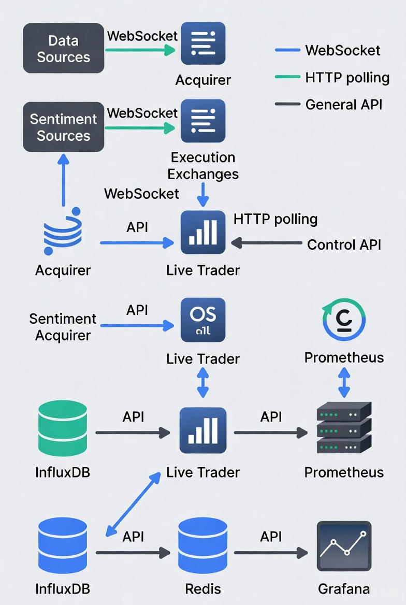
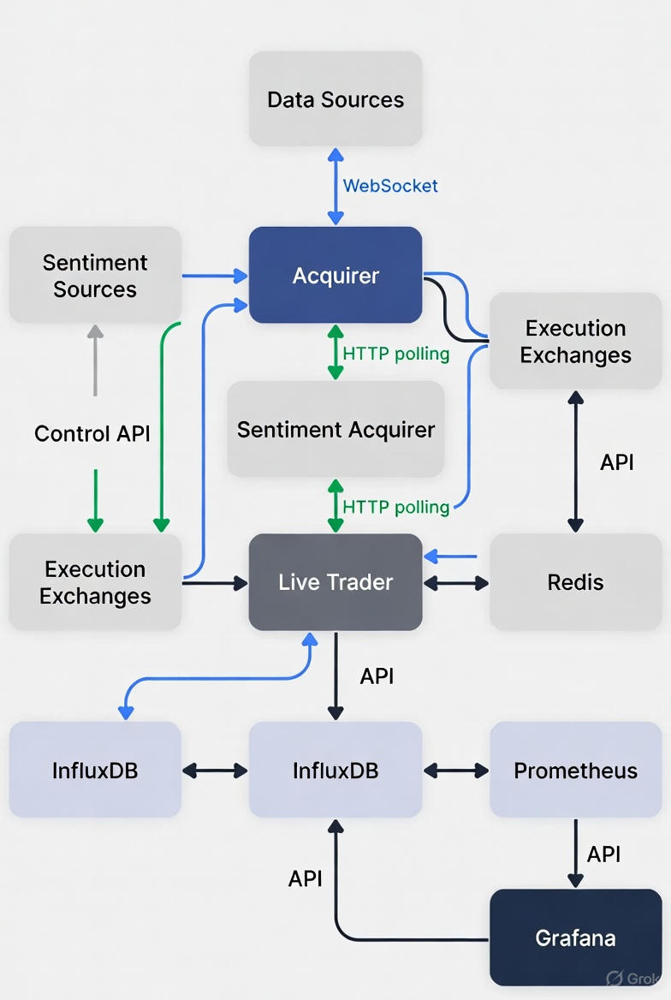

# Bot de Trading à Microservices (Python, FastAPI, IA)

**Statut du projet :** v1.0 (Projet de stage) - Actuellement en v2.0 (Développement personnel)

> Un bot de trading algorithmique pour cryptomonnaies, basé sur une architecture microservices événementielle, conteneurisé avec Docker et piloté par l'IA.

---

### L'Histoire de ce Projet (Le "Pourquoi")

Ce projet est né d'une ambition personnelle : explorer la finance quantitative et le trading algorithmique.

Mon objectif initial était de construire un bot de Trading Haute Fréquence (HFT). J'ai rapidement réalisé que le HFT pur est irréalisable sans une infrastructure matérielle et logicielle de niveau industriel (proximité des serveurs d'échange, flux de données payants à faible latence).

J'ai donc opéré un pivot stratégique vers une approche de "Scalping Intelligent" (Scalping + IA).

La v1.0 (ce projet de stage) m'a permis de construire l'architecture fondamentale : un système de microservices robuste capable de :
1.  Ingérer des données de marché (prix) via WebSockets.
2.  Ingérer des données de sentiment (ex: Twitter).
3.  Gérer l'état, les ordres et les files d'attente (Redis).
4.  Stocker des données de séries temporelles (InfluxDB).
5.  Monitorer l'ensemble du système (Grafana).

Lors des tests, je me suis heurté à une deuxième contrainte : la qualité des données de sentiment des API gratuites (Twitter) est insuffisante pour un modèle de prédiction fiable. J'ai donc pris la décision d'ingénieur de désactiver temporairement l'exploitation du sentiment pour me concentrer sur une stratégie purement technique, basée sur des modèles (LSTM, GRU, XGBoost) entraînés sur des données de prix historiques.

Ce projet m'a permis de comprendre le cycle de vie complet d'un système de trading et de bâtir une fondation solide. Le travail se poursuit sur la v2.0.

---

### 📺 Démonstration Visuelle (v1.0)

Le projet n'étant pas déployé, voici un aperçu de l'architecture et du dashboard.

**Architecture des Microservices :**
 


---

### 📋 Table des Matières

1.  [Problématique & Solution (v1.0)](#problématique--solution-v10)
2.  [Fonctionnalités Clés](#fonctionnalités-clés)
3.  [Stack Technique](#stack-technique)
4.  [Statut Actuel & Travaux Futurs (v2.0)](#-statut-actuel--travaux-futurs-v20)
5.  [Installation & Lancement (v1.0)](#-installation--lancement-v10)

---

### 🎯 Problématique & Solution (v1.0)

**Le Problème :** Concevoir un système de trading capable de gérer des flux de données à haute vélocité, d'intégrer des modèles d'IA et de garantir une robustesse 24/7.

**Ma Solution :** Une architecture microservices événementielle entièrement conteneurisée.
* **Acquisition :** Des services en Python asynchrone (`asyncio`) collectent les données de marché (WebSockets) et de sentiment (API REST) indépendamment.
* **Stockage & État :** **InfluxDB** est utilisé pour le stockage haute performance des séries temporelles (prix) et Redis agit comme bus de messages (Pub/Sub) et gestionnaire d'état.
* **IA & Stratégie :** Une stratégie multi-modèles (XGBoost, LSTM, GRU) analyse les signaux techniques. *(Note : Le pipeline de collecte pour l'analyse de sentiment est fonctionnel, mais cette stratégie v1.0 est focalisée sur les signaux techniques.)*
* **Contrôle & Monitoring :** L'ensemble est piloté par une API de contrôle (FastAPI) et supervisé en temps réel via une pile Prometheus et Grafana.

### ✨ Fonctionnalités Clés

* **Architecture Distribuée :** Services indépendants et résilients (Docker).
* **Pipelines de Données Doubles :** Ingestion séparée pour les données de marché (temps réel) et les données de sentiment.
* **Gestion de Données Asynchrone :** Collecte via `asyncio` pour une haute performance.
* **Bases de Données Spécialisées :** InfluxDB (Time-Series) et Redis (Cache/État/File d'attente).
* **Monitoring de Niveau Professionnel :** Pile complète Prometheus & Grafana.
* **API de Contrôle :** Endpoint FastAPI pour piloter le bot (démarrer, arrêter, "panic button").

### 🛠️ Stack Technique

| Domaine | Technologie |
| :--- | :--- |
| **Backend & IA** | Python 3.10+, asyncio, FastAPI, PyTorch |
| **Bases de Données** | InfluxDB (Time-Series), Redis (Cache & Pub/Sub) |
| **DevOps** | Docker, Docker Compose |
| **Monitoring** | Prometheus, Grafana |

---

### 🔮 Statut Actuel & Travaux Futurs (v2.0)

Ce projet est la fondation de mes explorations en finance quantitative. Le travail continue pour :
- **Amélioration des Modèles :** Affiner les modèles de prédiction (LSTM, GRU) avec les données collectées par le bot (et non plus des données externes).
- **Intégration du Sentiment :** Trouver des sources de données de sentiment plus fiables (ou des modèles plus robustes) pour exploiter le pipeline déjà construit.
- **Backtesting Rigoureux :** Développer un module de backtesting plus robuste pour valider les stratégies avant tout déploiement simulé.

---

### 🚀 Installation & Lancement (v1.0)

Ce projet est entièrement conteneurisé. L'installation est simple à condition d'avoir Docker et Docker Compose installés.

**Prérequis :**
* [Docker](https://www.docker.com/get-started)
* [Docker Compose](https://docs.docker.com/compose/install/)

**Instructions :**

1.  Clonez ce dépôt :
    ```bash
    git clone https://github.com/Obed-Sadia/bot-trading.git
    cd bot-trading
    ```

2.  Créez un fichier `config.yml` à partir de `config.example.yml` et ajoutez vos clés d'API (Binance, Kraken, etc.).
    ```bash
    cp config.example.yml config.yml
    # ... éditez le fichier config.yml ...
    ```

3.  Lancez l'ensemble de la pile :
    ```bash
    docker-compose up --build
    ```

4.  Ouvrez votre dashboard Grafana (`http://localhost:3000`) pour visualiser les métriques du système, les données de marché, les sentiments, et les performances du bot.

5. Accédez à l'interface Prometheus (`http://localhost:9090`) pour explorer les métriques brutes scrapées des services 

6. Ouvrez l'UI d'InfluxDB (`http://localhost:8086`) pour inspecter la base de données timeseries

7. Utilisez le Control API (`http://localhost:8008`) comme centre de contrôle pour gérer les services du bot
